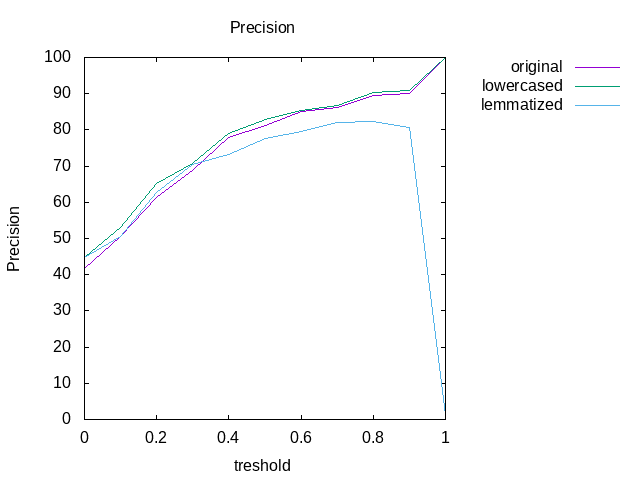
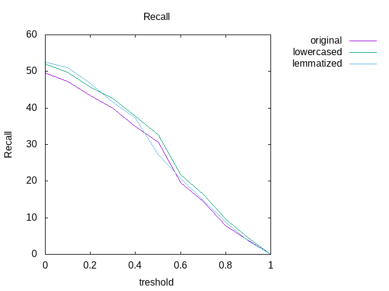

# ALIGNMENT

## Original text

| tres | AER   | prec   | rec   |
|------|-------|--------|-------|
| 0.0  | 76.40 | 41.77  | 49.56 |
| 0.1  | 74.48 | 50.69  | 47.26 |
| 0.2  | 73.62 | 61.34  | 43.42 |
| 0.3  | 74.01 | 68.68  | 39.92 |
| 0.4  | 75.34 | 77.95  | 34.98 |
| 0.5  | 77.34 | 81.30  | 30.72 |
| 0.6  | 83.83 | 84.98  | 19.62 |
| 0.7  | 87.45 | 86.22  | 14.47 |
| 0.8  | 92.74 | 89.60  | 7.78  |
| 0.9  | 96.36 | 90.08  | 3.76  |
| 1.0  | 99.99 | 100.00 | 0.01  |

## Lowercased text

| tres | AER    | prec   | rec   |
|------|--------|--------|-------|
| 0.0  | 75.03  | 44.73  | 51.98 |
| 0.1  | 73.26  | 53.16  | 49.73 |
| 0.2  | 72.18  | 65.16  | 45.82 |
| 0.3  | 72.70  | 70.63  | 42.58 |
| 0.4  | 73.87  | 79.13  | 37.86 |
| 0.5  | 76.21  | 82.85  | 32.63 |
| 0.6  | 82.44  | 85.35  | 21.69 |
| 0.7  | 85.98  | 86.62  | 16.45 |
| 0.8  | 91.14  | 90.25  | 9.67  |
| 0.9  | 95.64  | 90.93  | 4.51  |
| 1.0  | 100.00 | 100.00 | 0.00  |

## Lemmatized text

| tres | AER    | prec   | rec   |
|------|--------|--------|-------|
| 0.0  | 75.09  | 44.62  | 52.46 |
| 0.1  | 73.26  | 53.16  | 49.73 |
| 0.2  | 72.52  | 62.61  | 46.72 |
| 0.3  | 73.28  | 70.56  | 41.67 |
| 0.4  | 74.86  | 73.14  | 37.34 |
| 0.5  | 79.61  | 77.61  | 27.16 |
| 0.6  | 83.41  | 79.57  | 20.69 |
| 0.7  | 87.43  | 82.10  | 14.67 |
| 0.8  | 92.03  | 82.20  | 8.74  |
| 0.9  | 96.43  | 80.74  | 3.70  |
| 1.0  | 100.00 |  1.00  | 0.00  |

